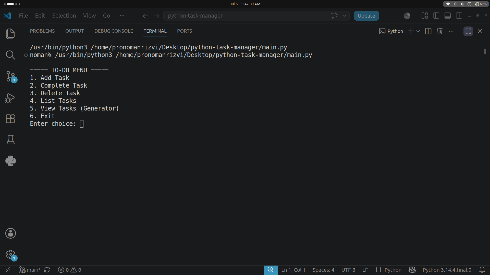
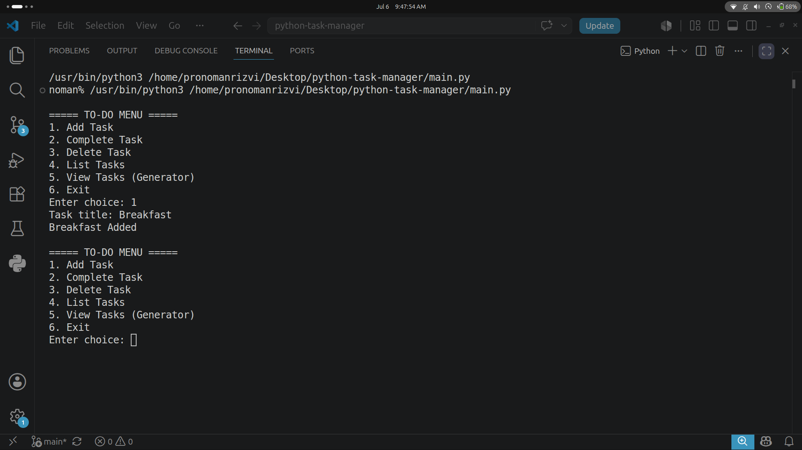
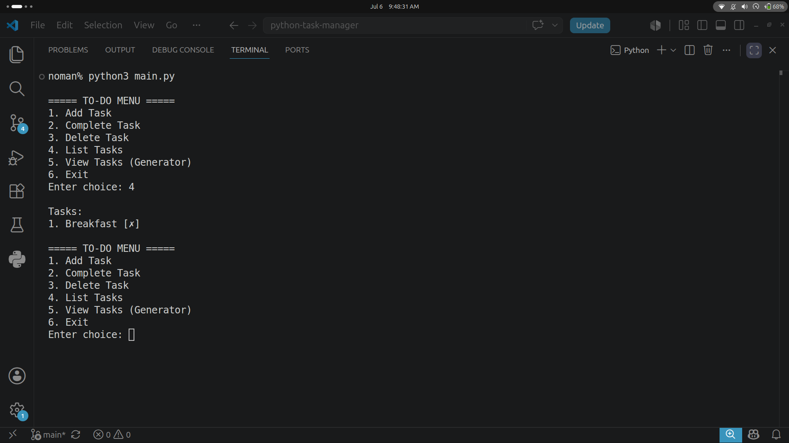
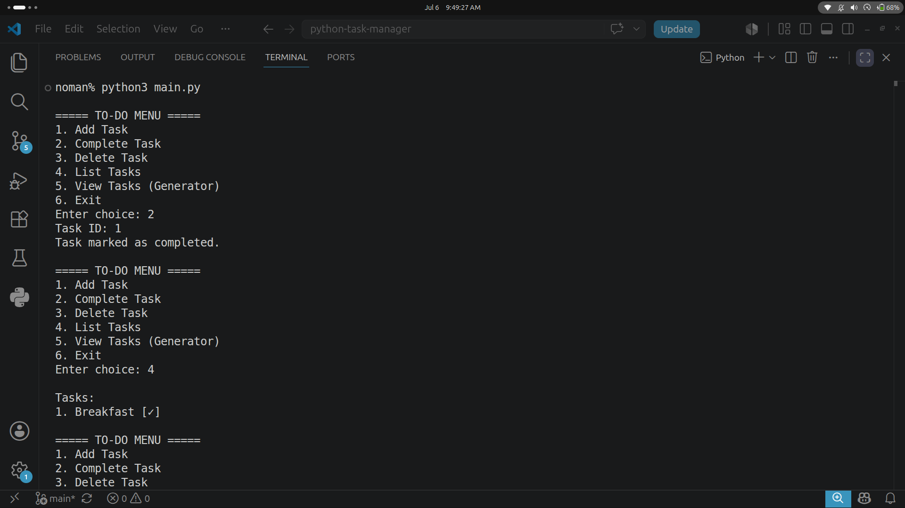
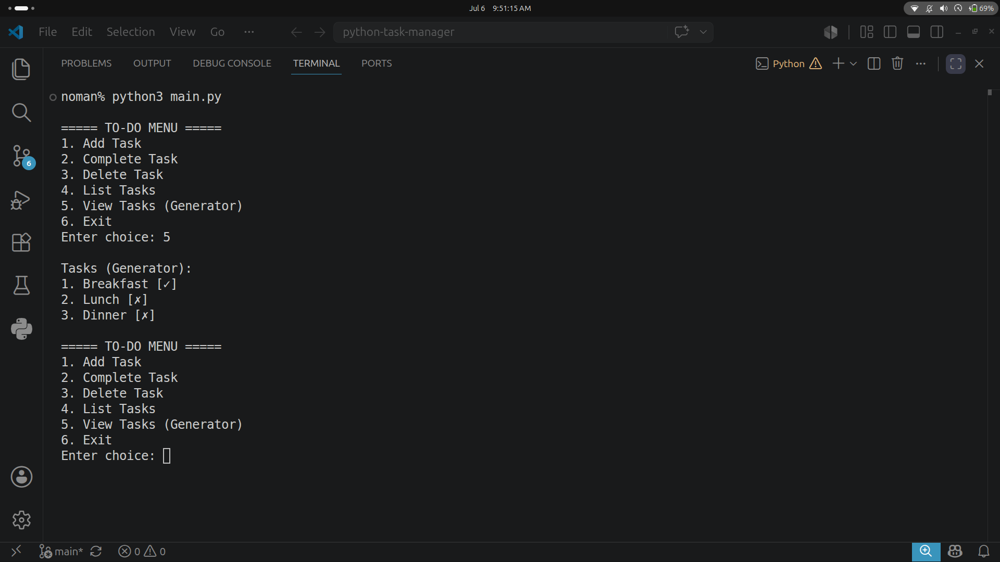

# Python CLI Task Manager

A simple command-line task management app built with core Python — no external dependencies. Built as a Phase 1 capstone project to practice functions, file I/O, error handling, decorators, and generators.

## Features

- Add, complete, delete, and list tasks
- Persistent storage using JSON Lines (`tasks.jsonl`)
- Function call logging via a custom decorator (`log.txt`)
- Memory-efficient task reading using a generator (reads tasks one line at a time instead of loading the whole file into memory)
- Graceful error handling for invalid input, missing files, and corrupted data

## Requirements

- Python 3.10+
- No third-party libraries required (standard library only)

## How to Run

```bash
python main.py
```

You'll see a menu:

```
===== TO-DO MENU =====
1. Add Task
2. Complete Task
3. Delete Task
4. List Tasks
5. View Tasks (Generator)
6. Exit
```

Enter the number corresponding to the action you want, and follow the prompts.

## Project Structure

```
python-task-manager/
├── screenshots/         # Terminal screenshots for documentation
├── log.txt              # Auto-generated function call logs
├── main.py              # Core application logic
├── README.md
├── requirements.txt      # Dependencies (none needed)
└── tasks.jsonl           # Task storage (JSON Lines format, auto-created)
```

## How It Works

### Storage Format
Tasks are stored in `tasks.jsonl`, where each line is an independent JSON object:

```json
{"id": 1, "title": "Dinner", "completed": false, "created_at": "2026-07-06, 09:23 AM"}
```

This format allows tasks to be read one line at a time without loading the entire file into memory — see the Generator section below.

### Decorator Logging
Every core function (`add_task`, `mark_complete`, `delete_task`, etc.) is wrapped with a `@log_call` decorator that writes a timestamped entry to `log.txt` every time the function runs, including the arguments passed.

### Generator (Memory-Efficient Reading)
The "View Tasks (Generator)" menu option uses `read_tasks_generator()`, which reads `tasks.jsonl` line by line using Python's lazy file iteration and `yield`s each task individually — the full file is never loaded into memory at once. This scales well even with a very large task list.

### Error Handling
- Invalid menu choices and non-numeric input are caught and handled
- Missing or corrupted `tasks.jsonl` is handled gracefully (returns an empty task list instead of crashing)
- Invalid task IDs during complete/delete operations are reported without crashing the app

## Example Usage

```
Enter choice: 1
Task title: Buy groceries
Buy groceries Added

Enter choice: 4

Tasks:
1. Buy groceries [✗]

Enter choice: 2
Task ID: 1
Task marked as completed.

Enter choice: 4

Tasks:
1. Buy groceries [✓]
```

## Screenshots

**Main Menu**


**Adding a Task**


**Listing Tasks**


**Marking a Task Complete**


**Generator View**


## Author

Muhammad Noman Rizvi ([@ProNomanRizvi](https://github.com/ProNomanRizvi))